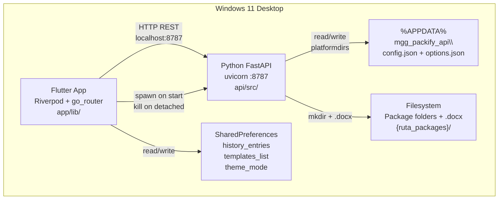
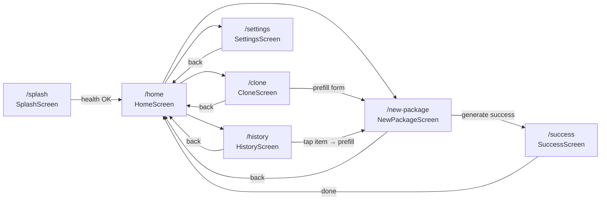
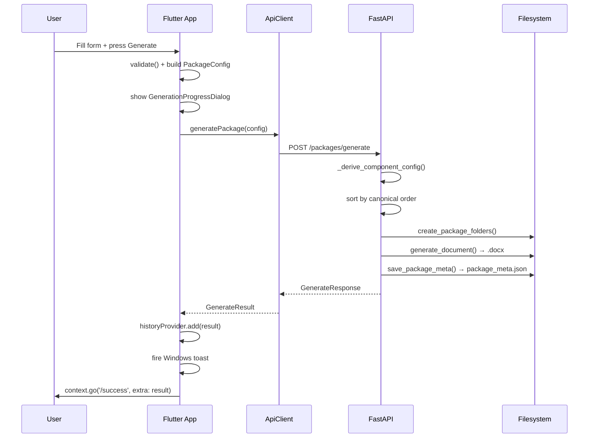
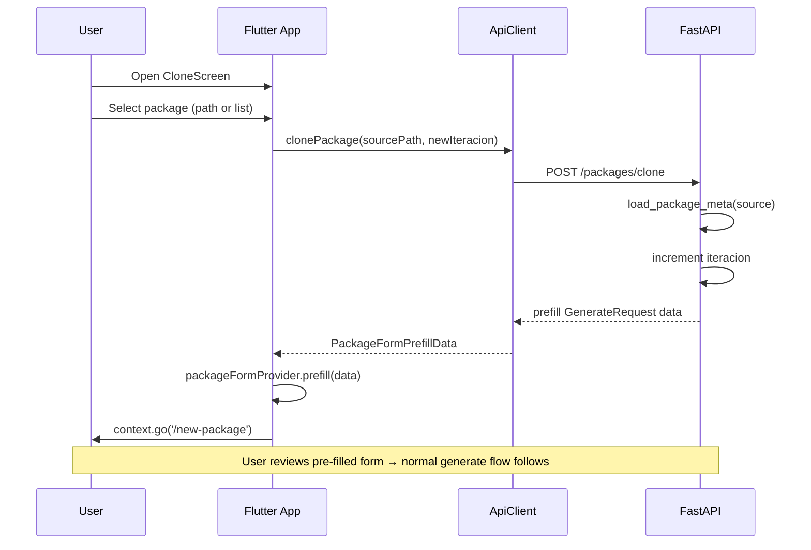
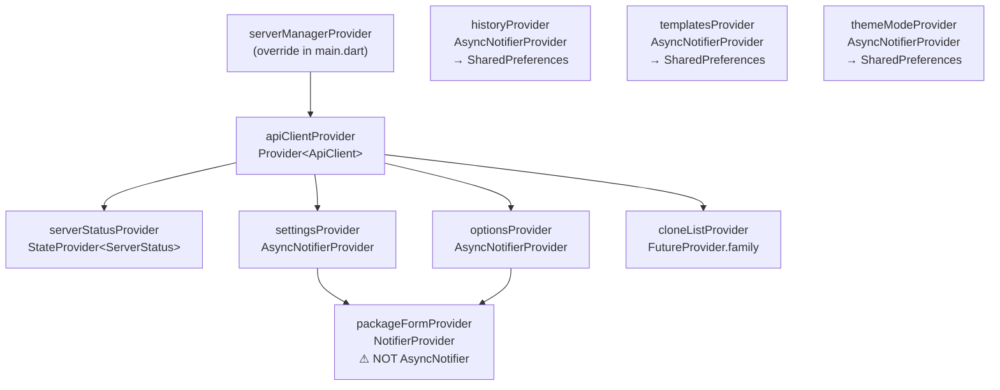
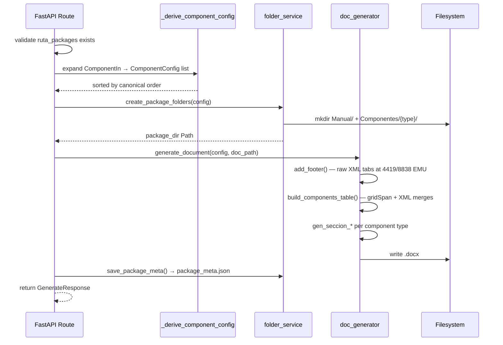

# Architecture — MGG-Packify

Generador de paquetes de instalación para múltiples proyectos y ambientes.  
Windows 11 desktop app: Flutter UI + Python FastAPI backend (proceso hijo).

> **Source of truth**: [`PROMPT_V3.md`](PROMPT_V3.md) (755 lines — authoritative for all domain rules).  
> For AI-agent quick-reference rules see [`AGENTS.md`](AGENTS.md).

---

## Table of Contents

1. [Tech Stack](#tech-stack)
2. [System Architecture](#system-architecture)
3. [Process Lifecycle](#process-lifecycle)
4. [Screen Navigation Flow](#screen-navigation-flow)
5. [Package Generation Sequence](#package-generation-sequence)
6. [Clone Flow Sequence](#clone-flow-sequence)
7. [Provider Dependency Graph](#provider-dependency-graph)
8. [State Management — Riverpod](#state-management--riverpod)
9. [Domain Model — Component Types](#domain-model--component-types)
10. [Package Name Format](#package-name-format)
11. [Folder Output Structure](#folder-output-structure)
12. [Config Persistence](#config-persistence)
13. [.docx Generation Pipeline](#docx-generation-pipeline)
14. [API Endpoints](#api-endpoints)
15. [Brand Colors](#brand-colors)
16. [Test Coverage](#test-coverage)
17. [Repository Layout](#repository-layout)

---

## Tech Stack

### Flutter App (`app/`)

| Layer | Technology | Version | Purpose |
|-------|-----------|---------|---------|
| UI Framework | Flutter | 3.41.2 | Windows desktop UI |
| Language | Dart | 3.11.0 | App language |
| State Management | flutter_riverpod | ^2.5.0 | Riverpod 2.x providers |
| Navigation | go_router | ^14.0.0 | Flat declarative router |
| HTTP Client | http | ^1.2.0 | REST calls to FastAPI |
| File Picker | file_picker | ^8.0.0 | Folder/file picker dialogs |
| URL Launcher | url_launcher | ^6.3.0 | Open folders in Explorer |
| Typography | google_fonts | ^6.2.0 | Font loading |
| Local Storage | shared_preferences | ^2.3.0 | History, templates, theme |
| Notifications | local_notifier | ^0.1.4 | Windows toast notifications |
| Path Utilities | path | ^1.9.0 | Cross-platform path ops |

### Python API (`api/`)

| Layer | Technology | Version | Purpose |
|-------|-----------|---------|---------|
| Language | Python | ≥3.12 | API language |
| REST Framework | fastapi | ≥0.110 | HTTP endpoints |
| ASGI Server | uvicorn[standard] | ≥0.29 | Server runner on port 8787 |
| Document Gen | python-docx | ≥1.0 | `.docx` generation |
| Config Paths | platformdirs | ≥4.0 | `%APPDATA%\mgg_packify_api\` |
| Validation | pydantic | ≥2.0 | Request/response schemas |
| Linter | ruff | ≥0.4 | Lint + format |
| Test Runner | pytest | ≥8.0 | API test suite |
| Test HTTP | httpx | ≥0.27 | TestClient for integration tests |

---

## System Architecture



### Process Management

`ServerManager` (`app/lib/core/server_manager.dart`) manages the API child process:

| Mode | Behavior |
|------|----------|
| **Release** | Launches `mgg-packify-api.exe` from same directory as Flutter `.exe` |
| **Dev** | Checks port 8787 (300 ms timeout); if listening → skip launch; if not → `python -m mgg_packify_api.main` from `api/` |
| **Shutdown** | `Process.kill()` on `AppLifecycleState.detached` |
| **Override** | `MGG_API_PATH` env var overrides the API path resolution |

### HTTP Client

`ApiClient` (`app/lib/core/api_client.dart`):

- Base URL: `http://127.0.0.1:8787` — hardcoded, never user-configurable
- Timeout: 30 seconds per request
- Errors: all non-2xx wrapped in `ApiException(message, statusCode)`
- Injected via `Provider<ApiClient>` with `ref.onDispose(client.dispose)`

---

## Screen Navigation Flow

All routes are **flat** (no nesting, no stack). **NEVER use `Navigator.pop()` or `context.pop()`.**  
Always navigate with `context.go('/route')`.



### Screen Reference

| Route | Screen | `state.extra` | Back Target | Notes |
|-------|--------|---------------|-------------|-------|
| `/splash` | `SplashScreen` | — | — | Polls `GET /health` up to 20×500ms; success → `/home` |
| `/home` | `HomeScreen` | — | — | 5 buttons: Nuevo, Clonar, Historial, Templates, Config |
| `/new-package` | `NewPackageScreen` | — | `/home` | 3-section form: Datos, Componentes, Detalle |
| `/success` | `SuccessScreen` | `GenerateResult` | `/home` | Copy name, open folder, open VS Code |
| `/clone` | `CloneScreen` | — | `/home` | Option A: manual path; Option B: list from `lastUsed` |
| `/settings` | `SettingsScreen` | — | `/home` | 5 tabs: QA, PROD, Opciones, Servicios API, Apariencia |
| `/history` | `HistoryScreen` | — | `/home` | Dismissible list; swipe-to-delete; tap → prefill form |

---

## Package Generation Sequence



---

## Clone Flow Sequence



---

## Provider Dependency Graph



---

## State Management — Riverpod

### Provider Table

| Provider | Riverpod Type | State | Persistence |
|----------|--------------|-------|-------------|
| `serverManagerProvider` | `Provider<ServerManager>` | Process handle | — (override in main) |
| `apiClientProvider` | `Provider<ApiClient>` | HTTP client singleton | — |
| `serverStatusProvider` | `StateProvider<ServerStatus>` | API health enum | — |
| `settingsProvider` | `AsyncNotifierProvider` | `SettingsModel` | `GET/PUT /settings` |
| `optionsProvider` | `AsyncNotifierProvider` | `OptionsModel` | `GET/PUT /settings/options` |
| `packageFormProvider` | **`NotifierProvider`** (sync!) | `PackageFormState` | — (transient) |
| `historyProvider` | `AsyncNotifierProvider` | `List<PackageHistoryEntry>` | SharedPrefs `history_entries` (cap 50) |
| `templatesProvider` | `AsyncNotifierProvider` | `List<PackageTemplate>` | SharedPrefs `templates_list` |
| `themeModeProvider` | `AsyncNotifierProvider` | `ThemeMode` | SharedPrefs `theme_mode` |
| `cloneListProvider` | `FutureProvider.family<..., String>` | `List<PackageListItem>` | `GET /packages/list?base_dir=` |

### Critical Rule: `update()` is reserved

```dart
// ✅ CORRECT — expose a save() method
Future<void> save(SettingsModel settings) async {
  state = const AsyncLoading();
  try {
    await ref.read(apiClientProvider).putSettings(settings);
    state = AsyncData(settings);
  } catch (e) {
    state = AsyncError(e, StackTrace.current);
    rethrow;
  }
}

// ❌ WRONG — DO NOT USE — update() is a Riverpod framework method
await update((current) => newValue);
```

### packageFormProvider is Notifier (NOT AsyncNotifier)

```dart
// packageFormProvider is synchronous — it reads from already-loaded providers
class PackageFormNotifier extends Notifier<PackageFormState> {
  @override
  PackageFormState build() => PackageFormState.initial();

  void prefill(PackageFormPrefillData data) { ... }
  void prefillFromHistory(PackageHistoryEntry entry) { ... }
  void reset() { ... }
}
```

---

## Domain Model — Component Types

8 types in **canonical order** (also the docx rendering order):

```text
liferay_build → sql → api_iis → api_docker → blob → liferay → assets → apim
```

### Expansion Rules (Flutter → API)

Flutter sends `{ tipo, instancias: [InstanceIn] }`. The API expands each instance to one or more `ComponentConfig` rows:

| Type | Expansion | NOMBRE | TIPO | CONTENEDOR | UBICACIÓN |
|------|-----------|--------|------|------------|-----------|
| `liferay_build` | 1 row/instance | `"#" + build_id` | `"BUILD"` | `"liferay"` | ambiente |
| `sql` | **1 row/script** | script name | `inst.tipo \|\| "SQL"` | `nombre_bd` | ambiente |
| `api_iis` | 1 row/instance | `nombre_servicio` | `"API"` | `"IIS"` | ambiente |
| `api_docker` | 1 row/instance | `nombre_servicio` | `"API"` | `"Docker"` | ambiente |
| `blob` | **1 row/archivo** | archivo name | `"Blob Storage"` | `"Azure Blob Storage"` | ambiente |
| `liferay` | 1 row/instance | `inst.nombre` | `"Liferay"` | `"Liferay"` | ambiente |
| `assets` | 1 row/instance | first archivo name | `"Assets"` | `"Assets"` | ambiente |
| `apim` | 1 row/instance | `nombre_servicio` | `"API Management"` | `"APIM"` | ambiente |

### Special Rules

- **`liferay_build`**: single-instance only (UI enforces max 1). Does **NOT** create a physical folder.
- **`sql`**: expands to 1 row **per script**, not per instance.
- **`blob`**: expands to 1 row **per archivo**, not per instance.
- **UBICACIÓN column**: always `ambiente` only — never concatenate with `base_datos`.
- **QA → UAT**: in the `.docx` Liferay Build section **only** — `ambiente_display = "UAT" if ambiente == "QA" else ambiente`.

---

## Package Name Format

```text
{ticket}-{ProjectName}_{AMBIENTE}-{iteracion.zfill(2)}
```

Example: `INC-1234-MiProyecto_QA-03`

- `AMBIENTE` is always uppercase (normalized in the API)
- `iteracion` is zero-padded to 2 digits
- Clone auto-increments `iteracion` using regex `r'-(\d{2})$'`

---

## Folder Output Structure

```text
{ruta_packages}/
└── {package_name}/                   ← e.g. INC-1234-MiProyecto_QA-03/
    ├── Manual/                        ← always created
    └── Componentes/
        ├── API/                       ← api_iis + api_docker + apim all map here
        │   └── (IIS service files)
        ├── SQL/                       ← sql components
        │   └── {nombre_bd}/           ← subdirectory per database
        ├── BLOB STORAGE/              ← blob components
        ├── LIFERAY/                   ← liferay components
        └── ASSETS/                    ← assets components
```

> **Note**: `liferay_build` does **NOT** create a physical folder.  
> `api_iis`, `api_docker`, and `apim` all map to `Componentes/API/` (shared folder).

---

## Config Persistence

### Python side (`%APPDATA%\mgg_packify_api\` via `platformdirs`)

| File | Contents | Endpoint |
|------|----------|----------|
| `config.json` | Servers QA/PROD (`host`, `user`, `password`) + `last_used` flag | `GET/PUT /settings` |
| `options.json` | `estatus_list`, `tipo_sql_list`, `tipo_blob_list`, `api_iis_services`, `api_docker_services`, `sql_databases` | `GET/PUT /settings/options` |

### Flutter side (`SharedPreferences`)

| Key | Type | Provider | Cap |
|-----|------|----------|-----|
| `history_entries` | `List<PackageHistoryEntry>` JSON | `historyProvider` | 50 entries |
| `templates_list` | `List<PackageTemplate>` JSON | `templatesProvider` | unlimited |
| `theme_mode` | `String` (`"light"`, `"dark"`, `"system"`) | `themeModeProvider` | — |

---

## .docx Generation Pipeline



### Style Constants (`doc_generator.py`)

| Constant | Value | Usage |
|----------|-------|-------|
| `COLOR_VERDE_HEADER` | `#70AD47` | Table header row background |
| `COLOR_VERDE_BORDES` | `#C5E0B3` | Table cell borders |
| `COLOR_VERDE_GRUPO` | `#E2EFD9` | Group separator rows |
| `AUTOR_FOOTER` | `"Manuel García González"` | Footer — hardcoded |
| `FUENTE_DEFAULT` | `"Calibri"` | Body font |

> ⚠️ **DO NOT rewrite** `add_footer()` or `build_components_table()` — they use raw XML with precise EMU measurements and gridSpan cell merges. Rewriting them will break .docx rendering.

---

## API Endpoints

| Method | Path | Description |
|--------|------|-------------|
| `GET` | `/health` | Liveness check (used by SplashScreen polling) |
| `GET` | `/settings` | Get server config (QA + PROD servers) |
| `PUT` | `/settings` | Save server config |
| `GET` | `/settings/options` | Get estatus/tipo option lists |
| `PUT` | `/settings/options` | Save option lists |
| `POST` | `/packages/generate` | Generate package (folders + .docx) |
| `POST` | `/packages/clone` | Load existing `package_meta.json` for pre-fill |
| `GET` | `/packages/list?base_dir=` | List packages in a directory |

---

## .docx Style Constants

> **Note**: These colors are used in the Python `doc_generator.py` for .docx table styling. They are NOT the Flutter theme colors — the Flutter theme uses `Colors.blue` as its seed.

| Name | Hex | Usage |
|------|-----|-------|
| `COLOR_VERDE_HEADER` | `#70AD47` | .docx table headers |
| `COLOR_VERDE_LIGHT` | `#C5E0B3` | .docx table cell borders |
| `COLOR_VERDE_VERY_LIGHT` | `#E2EFD9` | .docx table group separator rows |
| `COLOR_AZUL` | `#4472C4` | .docx secondary accent |

---

## Test Coverage

| Suite | Count | Command |
|-------|-------|---------|
| pytest (API) | 87 tests | `cd api && python -m pytest` |
| flutter test | 161 tests | `cd app && flutter test` |

All tests must remain green after any change. Zero code changes in this documentation update means zero regression risk.

---

## Repository Layout

```text
mgg-packify/
├── PROMPT_V3.md               ← ORIGINAL SPEC — source of truth (755 lines)
├── ARCHITECTURE.md            ← this file — deep-dive with all diagrams
├── AGENTS.md                  ← AI agent quick-reference (rules, routes, providers)
├── README.md                  ← Human developer entry point (badges, quick start)
├── LICENSE                    ← MIT, 2026, Manuel Garcia Gonzalez
├── .gitignore                 ← Python + Flutter + IDE + OS patterns
├── .editorconfig              ← py=4sp, dart/md/yaml=2sp, lf endings
├── .vscode/
│   └── launch.json            ← 3 configs: API, Flutter, Compound
├── api/                       ← Python FastAPI backend
│   ├── AGENTS.md              ← API-specific AI context (endpoints + JSON examples)
│   ├── README.md              ← API developer quickstart
│   ├── pyproject.toml         ← dependencies + ruff config
│   └── src/mgg_packify_api/
│       ├── main.py            ← uvicorn entry point (:8787)
│       ├── routes/
│       │   ├── health.py      ← GET /health
│       │   ├── packages.py    ← generate, clone, list + _derive_component_config()
│       │   └── settings.py    ← GET/PUT /settings + /settings/options
│       ├── schemas/
│       │   ├── package.py     ← GenerateRequest/Response, ComponentIn, InstanceIn
│       │   ├── settings.py    ← ServerConfig, SettingsOut
│       │   └── options.py     ← OptionsOut
│       └── services/
│           ├── component.py       ← ComponentType StrEnum + FOLDER_MAP
│           ├── doc_generator.py   ← .docx generation (903 lines) ⚠ fragile XML
│           ├── folder_service.py  ← mkdir structure + package_meta.json
│           ├── options_service.py ← load/save options.json
│           ├── package.py         ← PackageConfig dataclass
│           ├── publish_service.py ← IIS publish (api_iis publicar=True)
│           └── settings_service.py← load/save config.json
└── app/                       ← Flutter Desktop app
    ├── AGENTS.md              ← Flutter-specific AI context (screens, providers, widgets)
    ├── README.md              ← Flutter developer quickstart
    ├── pubspec.yaml           ← Flutter dependencies
    └── lib/
        ├── main.dart          ← WidgetsFlutterBinding, ProviderScope, lifecycle
        ├── app.dart           ← go_router flat config + ThemeData
        ├── core/
        │   ├── api_client.dart    ← ApiClient + apiClientProvider
        │   ├── constants.dart     ← kApiPort, kBaseUrl
        │   └── server_manager.dart← Process spawn/kill + dev-mode port check
        ├── models/            ← 8 files
        │   ├── component_config.dart
        │   ├── generate_result.dart
        │   ├── options_model.dart
        │   ├── package_config.dart
        │   ├── package_history_entry.dart
        │   ├── package_list_item.dart
        │   ├── package_template.dart
        │   └── settings_model.dart
        ├── providers/         ← 8 files
        │   ├── clone_list_provider.dart
        │   ├── history_provider.dart
        │   ├── options_provider.dart
        │   ├── package_form_provider.dart
        │   ├── server_status_provider.dart
        │   ├── settings_provider.dart
        │   ├── templates_provider.dart
        │   └── theme_mode_provider.dart
        ├── screens/           ← 7 files
        │   ├── splash_screen.dart
        │   ├── home_screen.dart
        │   ├── new_package_screen.dart
        │   ├── success_screen.dart
        │   ├── clone_screen.dart
        │   ├── settings_screen.dart
        │   └── history_screen.dart
        └── widgets/           ← 5 files
            ├── component_detail_card.dart  ← 1162 lines, AnimationController
            ├── component_selector.dart     ← FilterChips in canonical order
            ├── generation_progress_dialog.dart ← Timer.periodic 600ms optimistic steps
            ├── package_name_preview.dart   ← live name preview + copy button
            └── server_form.dart            ← server URL fields per component type
```
