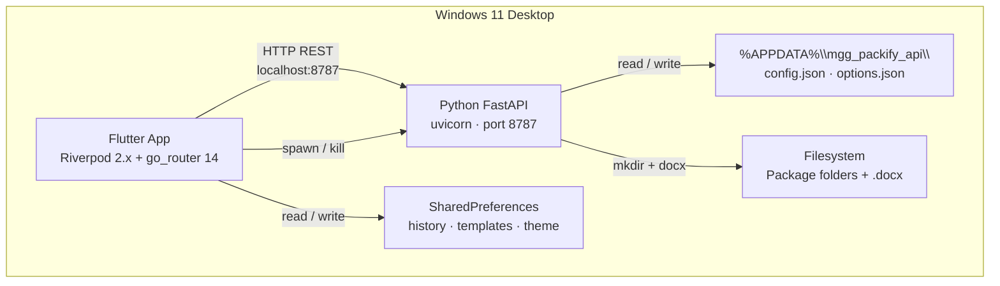

<p align="center">
  
</p>

# MGG-Packify

[](https://www.python.org/)
[](https://flutter.dev/)
[](https://fastapi.tiangolo.com/)
[](./LICENSE)
[](https://www.microsoft.com/windows/windows-11)
[](./api/)
[](./app/)

**Portal Retail Skandia México** — Windows 11 desktop app that generates installation packages (`.docx` document + folder structure) for retail portal deployments. Covers all 8 component types: SQL scripts, API IIS/Docker services, Blob Storage, Liferay builds, Assets, and API Management.

---

## Architecture

Flutter desktop UI spawns a Python FastAPI backend as a child process. All communication happens via HTTP REST on `localhost:8787`. Both processes live entirely on the same Windows machine — no cloud, no network, no external services.



<!-- ASCII fallback:
  Flutter App (Riverpod + go_router)
      |-- HTTP REST :8787 --> Python FastAPI (uvicorn)
      |-- spawn/kill -------> Python FastAPI
      |-- SharedPrefs ------> history, templates, theme
                                    |-- APPDATA --> config.json, options.json
                                    |-- mkdir + docx --> Filesystem
-->

> Full system diagrams, sequence diagrams, and provider dependency graph → [`ARCHITECTURE.md`](./ARCHITECTURE.md)

---

## Features

### Core

- 📦 **Package generation** — fills a `.docx` Installation Manual from a 5-field form + component selector
- 🗂️ **8 component types** — `liferay_build`, `sql`, `api_iis`, `api_docker`, `blob`, `liferay`, `assets`, `apim`
- 🌍 **Multi-environment** — QA / UAT / PROD with server URL configuration per environment
- 📄 **docx output** — table-based manual with branded header, footer, and "Componentes Afectados" table

### Beyond Original Spec

| Feature | Description |
|---------|-------------|
| **History** | Last 50 generated packages in SharedPreferences — swipe to delete, tap to re-generate |
| **Templates** | Save named component-type templates; quick-apply from Home screen |
| **Dark mode** | System / Light / Dark toggle (Apariencia tab in Settings) — persisted via SharedPreferences |
| **Publish pipeline** | `api_iis` instances with `publicar: true` trigger MSBuild / `dotnet publish` + ZIP output |
| **Image injection** | `ConfigItemIn.imagen_path` embeds a custom image into the generated `.docx` |
| **Toast notifications** | Windows native toast shown after every successful package generation |
| **Clone & re-generate** | Pick an existing package folder, auto-increment iteration, prefill the form |
| **Server form widget** | Contextual server URL fields per component type in Settings and NewPackage screens |

---

## Tech Stack

| Layer | Technology | Version | Purpose |
|-------|-----------|---------|---------|
| UI | Flutter (Windows) | 3.41.4 | Desktop UI framework |
| UI | Dart | 3.11.1 | Language |
| UI | flutter_riverpod | ^2.5.0 | State management |
| UI | go_router | ^14.0.0 | Flat declarative routing |
| UI | http | ^1.2.0 | HTTP client for API calls |
| UI | shared_preferences | ^2.3.0 | Local persistence (history, templates, theme) |
| UI | google_fonts | ^6.2.0 | Typography |
| UI | file_picker | ^8.0.0 | Folder selection dialogs |
| UI | url_launcher | ^6.3.0 | Open output folder in Explorer |
| UI | local_notifier | ^0.1.4 | Windows native toast notifications |
| UI | path | ^1.9.0 | Cross-platform path utilities |
| API | Python | ≥3.12 | Backend language |
| API | FastAPI | ^0.110 | REST framework |
| API | uvicorn[standard] | ^0.29 | ASGI server |
| API | python-docx | ^1.0 | `.docx` generation |
| API | pydantic | ^2.0 | Request / response validation |
| API | platformdirs | ^4.0 | `%APPDATA%` path resolution |

---

## Prerequisites

| Requirement | Version | Notes |
|-------------|---------|-------|
| Python | ≥ 3.12 | No virtualenv — global install |
| Flutter | 3.41.4 | Windows desktop target must be enabled |
| Windows | 11 | Target platform only |
| VS Code | Any recent | Recommended: Flutter + Python extensions |

---

## Quick Start

### 1 — Clone the repo

```bash
git clone https://github.com/mgg/mgg-packify.git
cd mgg-packify
```

### 2 — Install the API

```bash
# No virtualenv — packages installed globally
pip install -e api/
```

### 3 — Install Flutter dependencies

```bash
cd app
flutter pub get
```

### 4 — Run (VS Code — recommended)

Open the project in VS Code and use the **API + App (full stack)** compound launch config from `.vscode/launch.json`. This starts both processes simultaneously.

### 5 — Run (CLI — two terminals)

```bash
# Terminal 1 — API backend
cd api
python -m mgg_packify_api.main
# → Listening on http://127.0.0.1:8787

# Terminal 2 — Flutter app
cd app
flutter run -d windows
```

The Flutter app polls `GET /health` on startup. Once the API responds, the app navigates to the Home screen.

---

## Testing

```bash
# API — 87 tests
cd api
python -m pytest

# API — verbose
cd api
python -m pytest -v

# Flutter — 161 tests
cd app
flutter test

# Flutter — single file
cd app
flutter test test/providers/settings_provider_test.dart

# Regenerate mocks (after changing providers or ApiClient)
cd app
dart run build_runner build --delete-conflicting-outputs
```

---

## Project Documentation

| File | Audience | Contents |
|------|----------|---------|
| [`PROMPT_V3.md`](./PROMPT_V3.md) | All | **Source of truth** — original 755-line specification |
| [`ARCHITECTURE.md`](./ARCHITECTURE.md) | Devs / AI | System diagrams, data flow, provider graph, screen flow, folder output tree |
| [`AGENTS.md`](./AGENTS.md) | AI agents | Critical rules, domain quick-ref, file map, test commands |
| [`api/AGENTS.md`](./api/AGENTS.md) | AI (API) | All 8 endpoints with JSON examples, generate pipeline diagram, Python gotchas |
| [`app/AGENTS.md`](./app/AGENTS.md) | AI (Flutter) | All 7 screens, 8 providers, 5 widgets, navigation rules, Dart gotchas |
| [`api/README.md`](./api/README.md) | API devs | API install, run, test, endpoint table, config paths |
| [`app/README.md`](./app/README.md) | Flutter devs | Flutter run, test, lint, mock regen commands |

---

## Contributing

Before touching any code, read [`AGENTS.md`](./AGENTS.md) — it contains critical rules that prevent subtle bugs.

### Key constraints

| Rule | Detail |
|------|--------|
| **No virtualenv** | `pip install -e api/` installs globally — never create a venv |
| **All tests must pass** | Run `python -m pytest` (API) + `flutter test` (Flutter) after every change |
| **Navigation** | Always `context.go('/route')` — never `Navigator.pop()` or `context.pop()` (flat router, no stack) |
| **State management** | Never call `AsyncNotifier.update()` — use the custom `save()` method on each notifier |
| **Port 8787** | Hardcoded in both Flutter (`constants.dart`) and API (`main.py`) — do NOT change |
| **Dialog exception** | `Navigator.of(ctx).pop()` inside `showDialog` builders is the ONE valid Navigator use |

### Dev workflow

```bash
# 1. Make your changes
# 2. Run API tests
cd api && python -m pytest

# 3. Run Flutter tests
cd app && flutter test

# 4. If you changed providers or ApiClient — regenerate mocks
cd app && dart run build_runner build --delete-conflicting-outputs

# 5. Lint
cd api && ruff check . && ruff format --check .
cd app && flutter analyze && dart format --set-exit-if-changed .
```

---

## License

[MIT](./LICENSE) © 2026 Manuel Garcia Gonzalez
