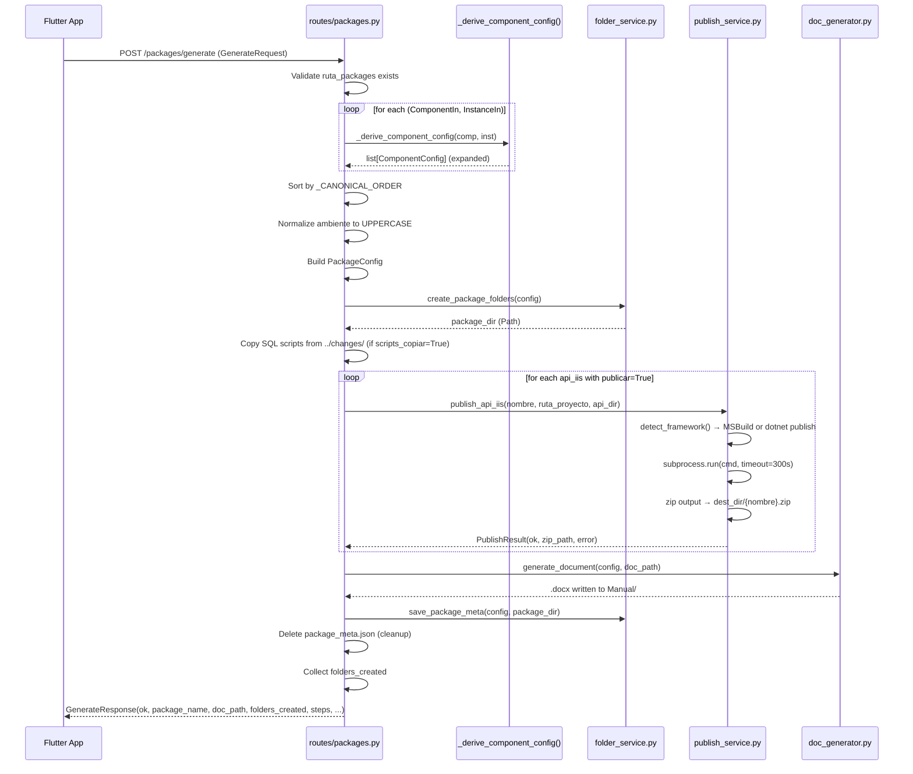

# AGENTS.md — API (Python FastAPI)

Context for AI agents working on the Python backend of MGG-Packify.

> **Domain rules (8 component types, table mapping, expansion rules, package name format)**
> live in the [root AGENTS.md](../AGENTS.md). Read it before touching any generation logic.

---

## Critical Rules — Read First

| Rule | Detail |
|------|--------|
| **No virtualenv** | Packages installed globally. If `import mgg_packify_api` fails: `pip install -e api/` |
| **Port 8787 is hardcoded** | Never change it. Flutter and API both reference it |
| **All 120 tests must pass** | Run `python -m pytest` after every change |
| **liferay_build has NO folder** | Guarded in `folder_service.py` — do not remove that guard |
| **UBICACIÓN = ambiente only** | Never concatenate `base_datos` into UBICACIÓN |
| **QA → UAT only in docx** | Only in `gen_seccion_liferay_build()` — nowhere else |
| **Footer XML** | `add_footer()` uses raw XML with tab stops at 4419/8838 EMU — do NOT rewrite |
| **Cell merges** | `build_components_table()` uses gridSpan + XML — do NOT rewrite |

---

## Running

```bash
# From repo root
cd api
python -m mgg_packify_api.main

# Or as installed script
mgg-packify-api
```

## Testing

```bash
cd api
python -m pytest              # all 120 tests
python -m pytest -v           # verbose
python -m pytest tests/test_packages_derive.py  # single file
```

---

## Package Layout

```
api/
├── pyproject.toml
├── mgg-packify-api.spec      ← PyInstaller spec (onefile build)
└── src/mgg_packify_api/
    ├── main.py               ← FastAPI app + uvicorn entry point + RotatingFileHandler setup
    ├── routes/
    │   ├── health.py         ← GET /health (version via importlib.metadata)
    │   ├── logs.py           ← GET /logs
    │   ├── packages.py       ← POST /packages/generate, /clone, GET /list
    │   └── settings.py       ← GET/PUT /settings, /settings/options
    ├── schemas/
    │   ├── package.py        ← GenerateRequest/Response, ComponentIn, InstanceIn, etc.
    │   ├── settings.py       ← ServerConfig, SettingsOut
    │   └── options.py        ← OptionsOut schema
    └── services/
        ├── component.py      ← ComponentType enum, ComponentConfig dataclass
        ├── doc_generator.py  ← .docx generation (903 lines)
        ├── folder_service.py ← mkdir structure, package_meta.json
        ├── options_service.py← load/save options.json
        ├── package.py        ← PackageConfig dataclass, package_name property
        ├── publish_service.py← dotnet/MSBuild publish + zip for api_iis
        └── settings_service.py ← load/save config.json
```

---

## Endpoints

| Method | Path | Handler | Auth | Description |
|--------|------|---------|------|-------------|
| `GET` | `/health` | `health.py` | None | Liveness check — Flutter SplashScreen polls this |
| `GET` | `/settings` | `settings.py` | None | Load server config + last_used from `config.json` |
| `PUT` | `/settings` | `settings.py` | None | Persist server config + last_used to `config.json` |
| `GET` | `/settings/options` | `settings.py` | None | Load option lists from `options.json` |
| `PUT` | `/settings/options` | `settings.py` | None | Persist option lists to `options.json` |
| `POST` | `/packages/generate` | `packages.py` | None | Full package generation pipeline |
| `POST` | `/packages/clone` | `packages.py` | None | Read `package_meta.json` for pre-fill (clone flow) |
| `GET` | `/packages/list` | `packages.py` | None | List package subdirectories in a given path |
| `GET` | `/logs` | `logs.py` | None | Read last N lines from `api.log` or `app.log` — `?source=api&lines=200` |

### GET /health

```json
// Response 200
{ "status": "ok", "version": "3.5.0" }
```

### GET /settings

```json
// Response 200
{
  "servers": {
    "qa":   { "api": "http://qa-server/api", "bd": "QADB01", "blob": "https://qa.blob.core.windows.net", "liferay": "http://qa-liferay:8080" },
    "prod": { "api": "http://prod-server/api", "bd": "PRODDB01", "blob": "https://prod.blob.core.windows.net", "liferay": "http://prod-liferay:8080" }
  },
  "last_used": {
    "ticket": "INC-1234",
    "hu_nombre": "Login Portal",
    "ambiente": "QA",
    "iteracion": "02",
    "ruta_packages": "C:\\Packages\\MiProyecto"
  }
}
```

### PUT /settings

```json
// Request body — same shape as GET /settings response (SettingsSchema)
{
  "servers": {
    "qa":   { "api": "http://qa-server/api", "bd": "QADB01", "blob": "", "liferay": "" },
    "prod": { "api": "", "bd": "", "blob": "", "liferay": "" }
  },
  "last_used": {
    "ticket": "INC-1234",
    "hu_nombre": "Login Portal",
    "ambiente": "QA",
    "iteracion": "02",
    "ruta_packages": "C:\\Packages\\MiProyecto"
  }
}
```

### GET /settings/options

```json
// Response 200
{
  "estatus_options": ["modificado", "nuevo"],
  "tipo_sql_options": ["sp", "trigger", "script", "job"],
  "tipo_blob_options": ["css", "scss", "js"],
  "api_iis_services": [
    { "nombre": "WebRetailAuth", "ruta": "C:\\repos\\portal\\WebRetailAuth" }
  ],
  "api_docker_services": [
    { "nombre": "WorkerNotificaciones" }
  ],
  "sql_databases": ["RAWRAPSIIF", "RAWRETAILDB"]
}
```

### PUT /settings/options

```json
// Request body — same shape as GET /settings/options response (OptionsSchema)
{
  "estatus_options": ["modificado", "nuevo"],
  "tipo_sql_options": ["sp", "trigger", "script", "job"],
  "tipo_blob_options": ["css", "scss", "js"],
  "api_iis_services": [
    { "nombre": "WebRetailAuth", "ruta": "C:\\repos\\portal\\WebRetailAuth" }
  ],
  "api_docker_services": [],
  "sql_databases": ["RAWRAPSIIF"]
}

// Response 200 — returns persisted values (echo-back)
{
  "estatus_options": ["modificado", "nuevo"],
  "tipo_sql_options": ["sp", "trigger", "script", "job"],
  "tipo_blob_options": ["css", "scss", "js"],
  "api_iis_services": [
    { "nombre": "WebRetailAuth", "ruta": "C:\\repos\\portal\\WebRetailAuth" }
  ],
  "api_docker_services": [],
  "sql_databases": ["RAWRAPSIIF"]
}
```

### POST /packages/generate

**This is the core endpoint** — see the full pipeline diagram below.

```json
// Request body (GenerateRequest)
{
  "ticket": "INC-1234",
  "hu_nombre": "Login",
  "ambiente": "qa",
  "iteracion": "03",
  "ruta_packages": "C:\\Packages\\MiProyecto",
  "componentes": [
    {
      "tipo": "api_iis",
      "instancias": [
        {
          "nombre_servicio": "WebRetailAuth",
          "estatus": "modificado",
          "tipo": "",
          "publicar": true,
          "configs": [
            { "clave": "ConnectionString", "valor": "Server=QA01;Database=RETAIL;" }
          ],
          "scripts": [],
          "scripts_copiar": [],
          "archivos": [],
          "build_id": "",
          "base_datos": "",
          "nombre": "",
          "es_nueva": false,
          "crear_pagina": false,
          "pagina": "",
          "widgets": []
        }
      ]
    },
    {
      "tipo": "sql",
      "instancias": [
        {
          "base_datos": "RAWRAPSIIF",
          "scripts": ["001_add_column.sql", "002_update_data.sql"],
          "scripts_copiar": [true, false],
          "tipo": "sp",
          "estatus": "nuevo",
          "nombre_servicio": "",
          "configs": [],
          "archivos": [],
          "build_id": "",
          "nombre": "",
          "es_nueva": false,
          "publicar": false,
          "crear_pagina": false,
          "pagina": "",
          "widgets": []
        }
      ]
    }
  ]
}

// Response 200 (GenerateResponse)
{
  "ok": true,
  "package_name": "INC-1234-MiProyecto_QA-03",
  "package_dir": "C:\\Packages\\MiProyecto\\INC-1234-MiProyecto_QA-03",
  "doc_path": "C:\\Packages\\MiProyecto\\INC-1234-MiProyecto_QA-03\\Manual\\INC-1234-MiProyecto_QA-03.docx",
  "folders_created": [
    "Componentes",
    "Componentes\\API",
    "Componentes\\SQL",
    "Componentes\\SQL\\RAWRAPSIIF",
    "Manual"
  ],
  "steps": [
    { "label": "Publicar WebRetailAuth", "ok": true, "error": "" }
  ],
  "publish_outputs": [
    "C:\\Packages\\MiProyecto\\INC-1234-MiProyecto_QA-03\\Componentes\\API\\WebRetailAuth.zip"
  ],
  "copy_errors": []
}

// Response 200 — error case (ruta_packages does not exist)
{
  "ok": false,
  "package_name": "",
  "package_dir": "",
  "doc_path": "",
  "folders_created": [],
  "steps": [],
  "publish_outputs": [],
  "copy_errors": [],
  "error": "La ruta no existe: C:\\Packages\\MiProyecto"
}
```

### POST /packages/clone

```json
// Request body (CloneRequest)
{
  "source_path": "C:\\Packages\\MiProyecto\\INC-1234-MiProyecto_QA-02",
  "new_iteracion": "03"
}

// Response 200 — success
{
  "ok": true,
  "prefill": {
    "ticket": "INC-1234",
    "hu_nombre": "Login",
    "ambiente": "QA",
    "iteracion": "03",
    "ruta_packages": "C:\\Packages\\MiProyecto",
    "componentes": [...]
  },
  "error": ""
}

// Response 200 — package_meta.json not found
{
  "ok": false,
  "prefill": {},
  "error": "package_meta.json no encontrado en: C:\\Packages\\MiProyecto\\INC-1234-MiProyecto_QA-02"
}
```

### GET /packages/list

```
// Query param: base_dir (string, required)
GET /packages/list?base_dir=C%3A%5CPackages%5CMiProyecto
```

```json
// Response 200
{
  "packages": [
    {
      "name": "INC-1234-MiProyecto_QA-03",
      "path": "C:\\Packages\\MiProyecto\\INC-1234-MiProyecto_QA-03",
      "has_meta": false,
      "created_at": "2026-03-15T10:30:00"
    },
    {
      "name": "INC-1234-MiProyecto_QA-02",
      "path": "C:\\Packages\\MiProyecto\\INC-1234-MiProyecto_QA-02",
      "has_meta": true,
      "created_at": "2026-03-10T09:15:00"
    }
  ]
}

// Response 200 — base_dir does not exist (empty, not an error)
{ "packages": [] }
```

### GET /logs

```
// Query params: source (api|app, default: api), lines (int, default: 200)
GET /logs?source=api&lines=200
GET /logs?source=app&lines=100
```

```json
// Response 200
{
  "source": "api",
  "lines": [
    "2026-04-08 10:00:00,123 INFO     POST /packages/generate completed in 1.23s",
    "2026-04-08 10:00:01,456 WARNING  options.json not found — using defaults"
  ],
  "log_path": "C:\\Users\\user\\AppData\\Local\\MGG Packify\\logs\\api.log"
}

// Response 200 — log file does not exist yet
{
  "source": "api",
  "lines": [],
  "log_path": "C:\\Users\\user\\AppData\\Local\\MGG Packify\\logs\\api.log"
}
```

---

## Data Flow — Generate Pipeline



---

## Key Logic

### `_derive_component_config()` — `routes/packages.py`

The core expansion function. Converts `(ComponentIn, InstanceIn)` → `list[ComponentConfig]`:

| Component type | Expansion | `nombre_display` source | `contenedor` |
|---------------|-----------|------------------------|--------------|
| `liferay_build` | 1 row | `"#" + build_id` | `"liferay"` |
| `sql` | **1 per script** | script name | `inst.base_datos` |
| `api_iis` | 1 row | `nombre_servicio` | `"IIS"` |
| `api_docker` | 1 row | `nombre_servicio` | `"Docker"` |
| `blob` | **1 per archivo** | `archivo.nombre` | `"Azure Blob Storage"` |
| `liferay` | 1 row | `inst.nombre` | `"Liferay"` |
| `assets` | 1 row | first `archivo.nombre` | `"Assets"` |
| `apim` | 1 row | `nombre_servicio` | `"APIM"` |

Canonical order applied via `_CANONICAL_ORDER` list sort before building `PackageConfig`.

### `generate_document()` — `services/doc_generator.py`

Generates the .docx. Critical fidelity rules (ported 1:1 from v1):

- `add_footer()`: uses raw XML with tab stops at 4419/8838 EMU — **do NOT rewrite**
- `build_components_table()`: uses gridSpan + XML for cell merges — **do NOT rewrite**
- QA → UAT substitution: **only** in `gen_seccion_liferay_build()`
- Author footer: hardcoded `"Manuel García González"`
- Colors: header `#70AD47`, borders `#C5E0B3`, group separator `#E2EFD9`

### `publish_service.py` — API IIS Publish Pipeline

Triggered when an `api_iis` instance has `publicar: true`.

```
publish_api_iis(nombre, ruta, dest_dir)
  ├── detect_framework(ruta)
  │     ├── Parses *.csproj in ruta
  │     ├── <TargetFramework>net6.0</TargetFramework>  → "net6.0"  (dotnet path)
  │     └── <TargetFrameworkVersion>v4.7.2</TargetFrameworkVersion> → "v4.7.2" (MSBuild path)
  ├── IF framework starts with "v" (e.g. "v4.7.2"):
  │     find_msbuild() via vswhere.exe
  │     → MSBuild.exe /t:WebPublish /p:Configuration=Release /p:WebPublishMethod=FileSystem
  └── ELSE (.NET Core / .NET 5+):
        dotnet publish -c Release -o <tmp_dir>
  
  Output: dest_dir/{nombre}.zip (ZIP_DEFLATED)
  Result: PublishResult(ok, zip_path, error)
```

**Trigger**: `comp.tipo_clave == ComponentType.API_IIS and comp.publicar == True`  
**Catalog lookup**: service `nombre` must exist in `options.json → api_iis_services[].nombre`  
→ missing catalog entry produces `StepResult(ok=False, error="Servicio no encontrado en catálogo")`

---

## Config Persistence

### `config.json` — `services/settings_service.py`

Path: `%APPDATA%\mgg_packify_api\config.json` (via `platformdirs.user_data_dir()`)

```json
{
  "version": 1,
  "servers": {
    "qa":   { "api": "", "bd": "", "blob": "", "liferay": "" },
    "prod": { "api": "", "bd": "", "blob": "", "liferay": "" }
  },
  "last_used": {
    "ticket": "",
    "hu_nombre": "",
    "ambiente": "QA",
    "iteracion": "01",
    "ruta_packages": ""
  }
}
```

Behavior: missing file → returns defaults silently. Corrupt JSON → resets to defaults silently (logged as WARNING).

### `options.json` — `services/options_service.py`

Path: `%APPDATA%\mgg_packify_api\options.json` (via `platformdirs.user_data_dir()`)

```json
{
  "version": 3,
  "estatus_options": ["modificado", "nuevo"],
  "tipo_sql_options": ["sp", "trigger", "script", "job"],
  "tipo_blob_options": ["css", "scss", "js"],
  "api_iis_services": [
    { "nombre": "WebRetailAuth", "ruta": "C:\\repos\\portal\\WebRetailAuth" }
  ],
  "api_docker_services": [
    { "nombre": "WorkerNotificaciones" }
  ],
  "sql_databases": ["RAWRAPSIIF", "RAWRETAILDB"]
}
```

Behavior: missing file → returns defaults silently. Corrupt JSON → returns defaults silently (logged as WARNING).

---

## Domain Rules — Quick Reference

```python
# Canonical component order
COMPONENT_ORDER = [
    "liferay_build", "sql", "api_iis", "api_docker",
    "blob", "liferay", "assets", "apim"
]

# ComponentType is a StrEnum
class ComponentType(StrEnum):
    LIFERAY_BUILD = "liferay_build"
    SQL           = "sql"
    API_IIS       = "api_iis"
    API_DOCKER    = "api_docker"
    BLOB          = "blob"
    LIFERAY       = "liferay"
    ASSETS        = "assets"
    APIM          = "apim"

# liferay_build does NOT create a physical folder (guard in folder_service.py)
# sql/blob expand to N rows; others expand to 1 row per instance
# QA → UAT ONLY in gen_seccion_liferay_build()
# Package name: f"{ticket}-{project_name}_{ambiente.upper()}-{iteracion.zfill(2)}"
# Example: "INC-1234-MiProyecto_QA-03"
```

---

## Test Structure

```
api/tests/
├── conftest.py               ← TestClient fixtures
├── test_health.py            ← /health endpoint
├── test_logs.py              ← /logs endpoint (monkeypatches _log_dir)
├── test_settings.py          ← /settings CRUD
├── test_options.py           ← /settings/options CRUD
├── test_packages_generate.py ← POST /packages/generate (integration)
├── test_packages_clone.py    ← POST /packages/clone
├── test_packages_list.py     ← GET /packages/list
├── test_packages_derive.py   ← _derive_component_config() unit tests
├── test_doc_generator.py     ← doc generation smoke tests
└── test_schemas.py           ← Pydantic schema validation
```

---

## Gotchas

- LSP shows import errors in test files — these are **false positives** (PYTHONPATH not configured in LSP). Tests run fine with `python -m pytest`.
- `folder_service.py` line 144 has a Pyright type error — pre-existing, not a runtime issue.
- `liferay_build` NEVER creates a physical folder (checked in `folder_service.py` with a guard).
- UBICACIÓN column: always `ambiente` only — never concatenate with `base_datos`.
- `package_meta.json` is written then immediately deleted after generation (cleanup step in `generate_package()`). It only persists during the clone flow.
- SQL script copy reads from `../changes/` relative to `ruta_packages` (e.g. if packages are at `C:\Packages\MiProyecto`, changes folder is `C:\Packages\changes`).
- `publish_service.py` requires Visual Studio + MSBuild for `.NET Framework` projects; requires `dotnet` CLI on PATH for `.NET Core/5+` projects.
- `api_iis_services` catalog in `options.json` must be populated before `publicar: true` is used — otherwise every publish step returns `ok=False`.
